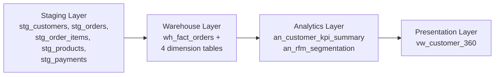
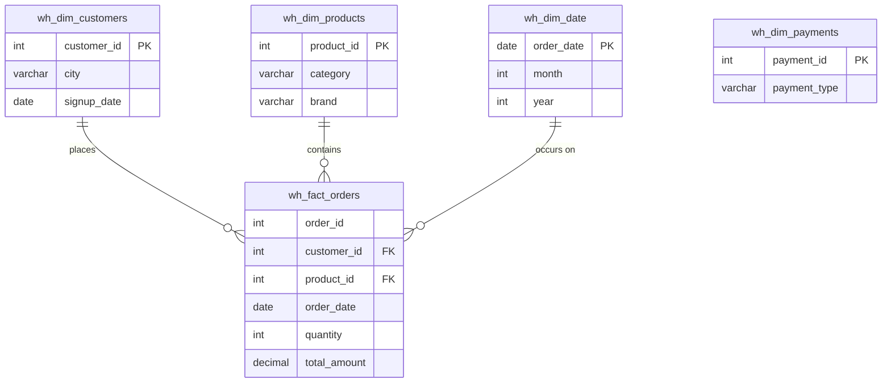

# Customer 360° E-Commerce Analytics Warehouse

A layered MySQL data warehouse that transforms raw e-commerce transaction data into business-ready customer intelligence — Customer Lifetime Value, RFM segmentation, and churn detection — built on a synthetic dataset of 250 customers and 1,500 orders.

  

---

## Business Problem

E-commerce companies generate large volumes of transactional data, but raw operational data does not directly provide insights into customer behaviour.

Businesses need to understand:
- Who are high value customers?
- Which customers are likely to churn?
- Who purchases frequently?
- How much revenue does each customer generate?

This project builds a Customer 360 analytics warehouse using MySQL to transform raw transactional data into business-ready customer intelligence.

---

## Project Architecture

The project follows a layered data warehouse architecture:

1. **Staging Layer** – Raw transactional data (OLTP simulation)
2. **Warehouse Layer** – Star schema for analytical processing
3. **Analytics Layer** – Customer KPI model and RFM segmentation
4. **Presentation Layer** – Final Customer 360 business view



### Star Schema (Warehouse Layer)



---

## Database Layers

### Staging Tables
- `stg_customers`
- `stg_orders`
- `stg_order_items`
- `stg_products`
- `stg_payments`

### Warehouse Tables
- `wh_fact_orders` — one row per order line item, filtered to `Delivered` orders only
- `wh_dim_customers`
- `wh_dim_products`
- `wh_dim_date`
- `wh_dim_payments`

### Analytics Tables
- `an_customer_kpi_summary`
- `an_rfm_segmentation`

### Presentation View
- `vw_customer_360`

---

## Customer KPIs

Customer-level metrics are calculated using SQL aggregations on `wh_fact_orders`:

| KPI | Definition |
|---|---|
| **CLV** (Customer Lifetime Value) | Total amount spent |
| **Recency** | Days since last purchase |
| **Frequency** | Number of orders placed |
| **Monetary** | Average order value |

---

## RFM Segmentation

Customers are scored on Recency, Frequency, and Monetary value using the `NTILE(4)` window function, splitting customers into quartiles on each dimension. Scores are then combined into four business segments:

- **Champions** – recent, frequent, high spenders
- **Loyal** – frequent, reasonably recent
- **At Risk** – used to be active, going quiet
- **Lost** – infrequent and/or long inactive

---

## Churn Detection

Customers with no delivered purchase in the last 90 days are flagged `Churned` in the final Customer 360 view; everyone else is `Active`.

---

## 📊 Results

*Computed on the current dataset: 250 customers, 1,500 orders (78% Delivered) over an 18-month window. Only customers with at least one delivered order appear in the KPI/RFM/presentation layers — 189 of the 250 customers.*

### Segment distribution

| Segment | Customers | Share |
|---|---|---|
| Lost | 70 | 37% |
| Loyal | 49 | 26% |
| Champions | 39 | 21% |
| At Risk | 31 | 16% |

### Churn status

| Status | Customers | Share |
|---|---|---|
| Active | 114 | 60% |
| Churned | 75 | 40% |

### Top 5 customers by CLV

| customer_id | city | CLV | recency (days) | frequency | monetary (avg order) | segment | churn_status |
|---|---|---|---|---|---|---|---|
| 53 | Pune | ₹935,981.65 | 10 | 27 | ₹34,665.99 | Champions | Active |
| 227 | Kolkata | ₹868,497.32 | 9 | 27 | ₹32,166.57 | Champions | Active |
| 72 | Mumbai | ₹731,120.90 | 5 | 25 | ₹29,244.84 | Champions | Active |
| 228 | Jaipur | ₹714,400.41 | 13 | 21 | ₹34,019.07 | Champions | Active |
| 150 | Delhi | ₹699,730.74 | 43 | 29 | ₹24,128.65 | Champions | Active |

### Key insights

- **Champions (21% of active customers) drive ~49% of total delivered revenue** — a small, high-value segment that a retention or loyalty program should prioritize.
- **40% of customers are flagged as churned** (no delivered order in 90+ days), signaling a meaningful win-back opportunity.
- The **Lost segment is the largest single group (37%)**, suggesting acquisition volume isn't converting into repeat purchases — worth investigating onboarding or first-purchase experience.
- Average CLV across active/delivered customers is **~₹190,947**, with a long tail — the top 5 customers alone account for a disproportionate share of revenue, typical of e-commerce Pareto (80/20) dynamics.

> Numbers may shift slightly by ±1 customer if you regenerate the dataset, due to how `NTILE()` breaks ties on quartile boundaries — the overall pattern (Champions driving disproportionate revenue, ~35-40% churn) should hold.

---

## How to Run

**Prerequisites:** MySQL 8.0+ (uses window functions: `NTILE()`)

1. Create/select a schema in MySQL Workbench (or CLI):
   ```sql
   CREATE DATABASE IF NOT EXISTS project;
   USE project;
   ```
2. Run the four layer scripts **in this exact order** (each depends on tables created by the previous one):
   ```
   staging_layer.sql
   warehouse_layer.sql
   analytics_layer.sql
   presentation_layer.sql
   ```
   In Workbench: `File → Open SQL Script...` → select the file → Execute (⚡, whole script — not statement-by-statement).
3. Verify:
   ```sql
   SELECT COUNT(*) FROM vw_customer_360;
   SELECT rfm_segment, COUNT(*) FROM vw_customer_360 GROUP BY rfm_segment;
   ```

All four scripts include `DROP TABLE/VIEW IF EXISTS` guards, so they can be re-run safely anytime (e.g. after regenerating the dataset with `generate_dataset.py`).

---

## Repo Structure

```
├── staging_layer.sql        -- raw OLTP tables + seed data
├── warehouse_layer.sql      -- star schema (fact + 4 dimensions)
├── analytics_layer.sql      -- KPI summary + RFM segmentation
├── presentation_layer.sql   -- vw_customer_360 final view
├── generate_dataset.py      -- synthetic data generator (customizable size)
├── customers.csv / products.csv / orders.csv /
│   order_items.csv / payments.csv   -- generated source data
└── README.md
```

---

## Tech Stack

- MySQL
- Data Warehousing
- Star Schema
- Window Functions (`NTILE`)
- RFM Segmentation
- ETL
- OLAP Modeling
